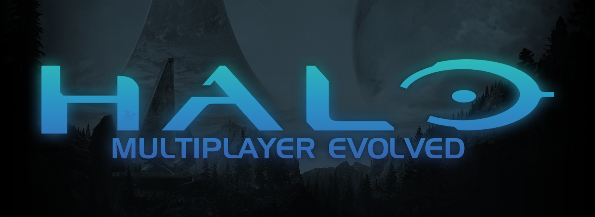

<div align="center">

<!-- Logo goes here. Drop it at docs/logo.png and it appears automatically. -->


# Halo Multiplayer Evolved

**The multiplayer Halo: Campaign Evolved should have shipped with.**

[](https://github.com/k3sra/halo-multiplayer-evolved/releases/latest)
[](https://github.com/k3sra/halo-multiplayer-evolved/releases/latest)
[](LICENSE)


</div>

---

The remake brought back the campaign and left the multiplayer behind. This puts it
back the way it was: the same modes, the same maps, the same feel. Not new content,
not a reinterpretation. The thing that was missing.

Play with friends over Steam. **No port forwarding, no launcher, no accounts.**

---

## Install

Both you and whoever you play with need the mod. It takes about thirty seconds.

**1.** [Download the latest release.](https://github.com/k3sra/halo-multiplayer-evolved/releases/latest)

**2.** Copy these three things into your game folder:

| | |
| --- | --- |
| `version.dll` | |
| `MultiplayerEvolved.dll` | |
| `MultiplayerEvolved/` | the folder |

into

```
Halo Campaign Evolved\Meteorite\Binaries\Win64\
```

> On Steam you can find that folder with **right click the game → Manage → Browse
> local files**, then open `Meteorite\Binaries\Win64`.

**3.** Start the game. There is now a **MULTIPLAYER** option at the top of the main
menu.

That is the whole install. To uninstall, delete those three things.

### It updates itself

You never have to come back here. The mod checks for a new version every time the
game starts and downloads it quietly in the background. The lobby's top right
corner shows what it is doing: `UPDATE FOUND`, then `DOWNLOADING 47%`, then
`UPDATE INSTALLED`.

**One update needs one restart.** Windows will not let a file replace itself while
it is loaded, so the new version is saved next to the running one and swapped in
the next time the game starts. When you see `UPDATE INSTALLED`, quit the game and
open it again. Until you do, you are still playing the old version, and the lobby
says so in the top left so you cannot miss it.

If an update ever goes wrong, the previous version is kept next to it as
`MultiplayerEvolved.dll.backup`, so nothing is lost.

### Is this safe for my game?

It never modifies your game files. If anything it needs is missing it simply does
nothing and writes the reason to `MultiplayerEvolved.log`. It cannot half-work and leave
you with a broken install.

---

## Roadmap

The goal is a 1:1 recreation of Halo: Combat Evolved multiplayer. Nothing more
imaginative than that.

| | Goal | State |
| --- | --- | --- |
| 1 | Two players in one lobby | Done |
| 2 | A match both players are in, on the same map at the same moment | Done |
| 2a | Seeing each other once you are in it | Next |
| 2b | Joining a game already in progress | Built |
| 3 | Slayer and Capture the Flag scoring exactly as they were | Planned |
| 4 | The original maps: Blood Gulch, Sidewinder, Hang 'Em High, the rest | Planned |
| 5 | Every original mode: King of the Hill, Oddball, Race, Juggernaut | Planned |
| 6 | Original weapon and vehicle balance, untouched | Planned |

---

## Status

What works today, honestly. Anything not yet tested says so.

**Working in game**

- The MULTIPLAYER menu entry, and the full lobby screen behind it
- Mode and map selection
- Team slots open a friends list and invite one person straight into your session.
  No Steam overlay involved, because the overlay does not draw over this game
- Team cards show who is actually in the session, by their Steam name
- Server browser with mode, slots and ping filters, and a refresh button. Your own
  game is left out of it, since joining yourself would only break the session you
  are hosting
- A server name, capped at 64 characters and remembered between launches
- Starting a match
- Hosting a public session others can find and be invited into
- Two players in one session, over the Steam relay, with no port forwarding
- Starting a match for everybody at once: a countdown every player sees, the same
  scenario and the same random seed, and nobody released until all have loaded
- Teams that balance themselves, with ties broken at random
- A status panel on the main menu and the lobby: connection, session, who is
  hosting, ping, and whether the build is current
- A loading screen for every wait: joining a lobby, starting a session, loading
  the map, waiting for the other players. It shows how far through the wait it
  is, what is happening at that moment, how long it has been going, and a way
  out. Where a real fraction exists it is shown; where none does, it says so
  rather than inventing one
- A guest sees the host's mode, map, settings and server name, greyed out. Only
  the host can change any of it, and that is enforced behind the screen as well
  as on it
- Checking for, downloading and installing updates

**Built, not yet proven with two people**

- Joining a session that is already in a match

**Not done yet**

- **Seeing each other in the match.** Both players load the same scenario at the
  same moment, on the same seed, and that part works. Nothing about the players
  is sent between machines once they are in it, so you each play your own copy.
  This is the next major piece of work and it is a large one
- Slayer and CTF scoring
- The original multiplayer maps

---

## Problems, questions, ideas

Use **[GitHub Issues](https://github.com/k3sra/halo-multiplayer-evolved/issues)**.
Please include your `MultiplayerEvolved.log`, which sits in the same folder you installed
into. It says what went wrong and it saves a lot of guessing.

---

## For developers

Everything technical lives in the docs rather than here.

| Document | What is in it |
| --- | --- |
| [AGENTS.md](AGENTS.md) | Commands, conventions, and the engine facts that cost time to learn. Read first |
| [Architecture](docs/00-ARCHITECTURE.md) | Why the game's simulation is a Blam engine, and what that means |
| [Engine binding](docs/04-ENGINE-BINDING.md) | Measured findings about the shipped binary |
| [Map format](docs/02-MAP-FORMAT.md) | The map model and its canonical binary form |
| [Packaging](docs/03-PACKAGING-AND-NEXUS.md) | How releases are built and published |

Building needs Visual Studio 2022 with the C++ desktop workload, and nothing else.
No SDK, no package manager.

```bash
build.bat install
```

The wire protocol has its own checks, which run in about a second and cover the
rules whose failures otherwise only show up with two machines and two people.

```bash
tools\protocol_check\build.bat
```

```bash
tools\session_check\build.bat
```

The second runs a real host and a real client against each other in one process,
over a loopback transport, through the real protocol. It covers the things that
otherwise need two machines and two people: a join completing, a guest being told
the host's mode and map, teams balancing, a match starting on both machines with
the same random seed, and leaving a session cleanly.

```bash
tools\steam_check\build.bat
```

The third talks to the real Steam client: it hosts a lobby, searches for it, and
calls every Steam function the mod uses. Needs Steam running and the game closed.

---

## Credits

Built on findings shared by
**[devnull9090](https://github.com/devnull9090)** and the
**[mjolnir-core](https://github.com/devnull9090/mjolnir-core)** project, which is
doing parallel work on the same game. Their engine research and their README
structure both fed directly into this.

## Contributing

Pull requests welcome. `main` is protected, so open one against `dev`.

Match the surrounding code. Comments explain why a decision was made, not what a
line does.

## Licence

MIT. See [LICENSE](LICENSE).

Not affiliated with Microsoft, 343 Industries or Valve. Halo is a trademark of
Microsoft.
